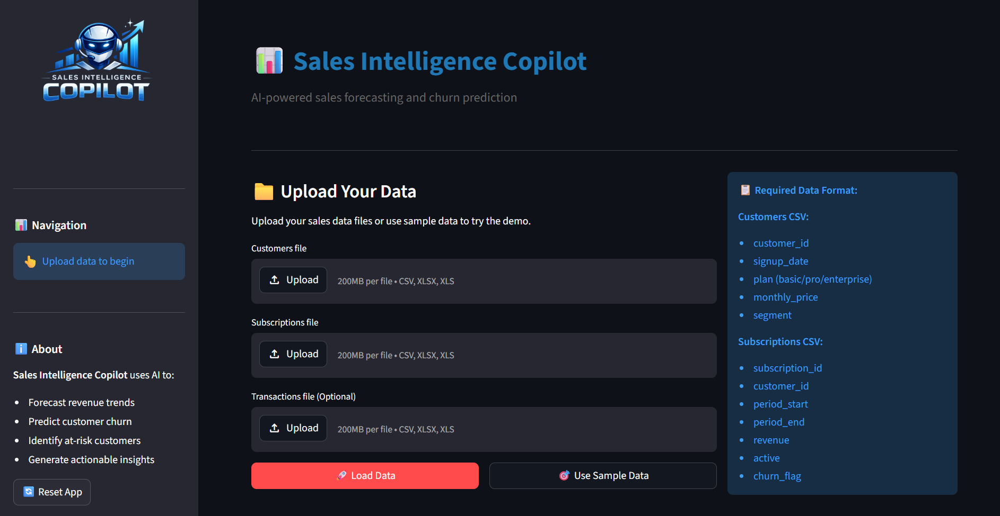
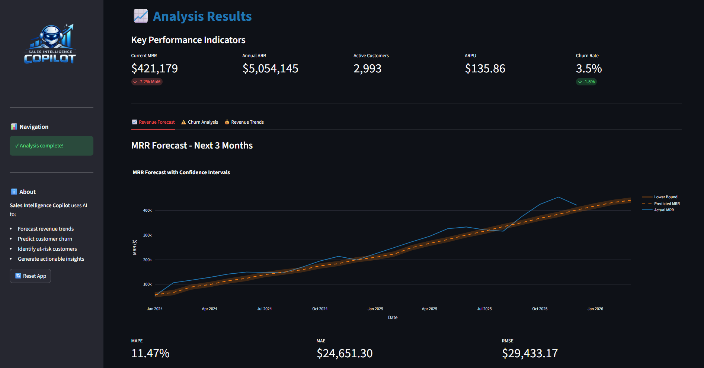
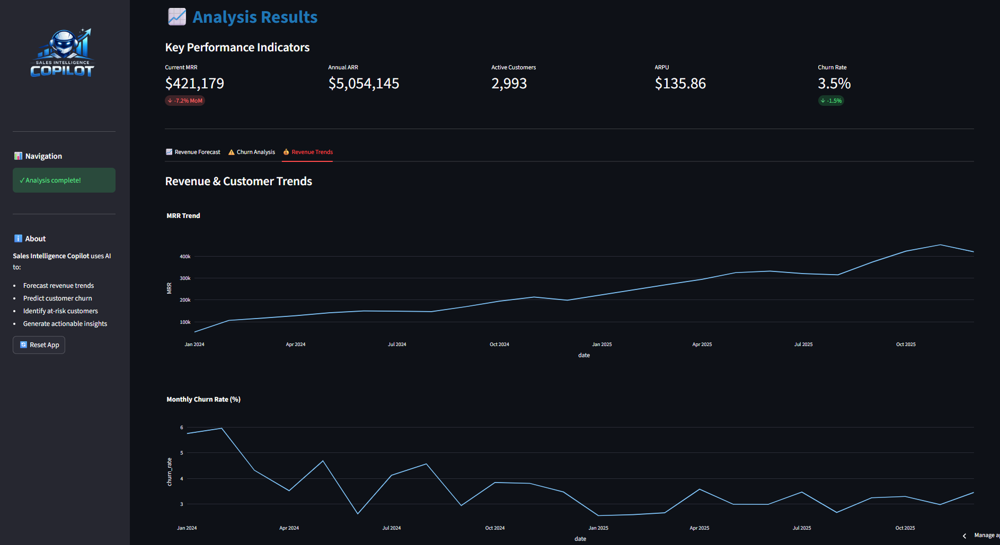
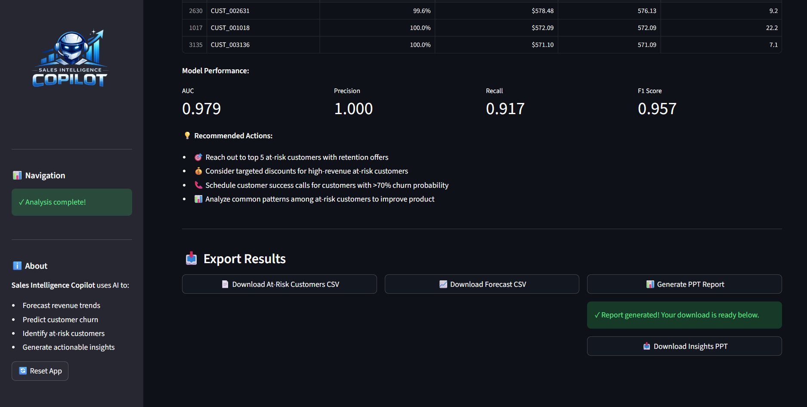
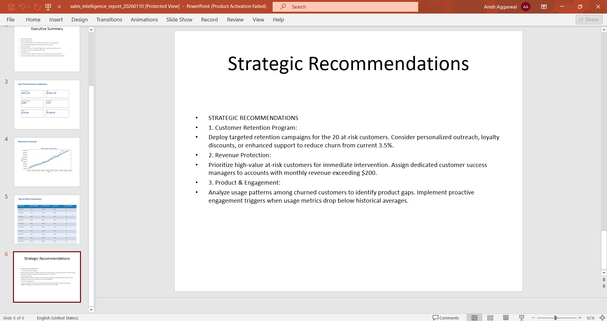

# Sales Intelligence Copilot

AI-powered SaaS analytics for **MRR forecasting**, **churn risk detection**, and **executive-ready PowerPoint reporting**.

[Click here to visit the deployed streamlit app.](https://anishaggarwal71-sales-intelligence-copilot-app-t4qxd1.streamlit.app/)

---

## 🚀 Features

- 📈 **MRR forecasting dashboard** with a 3-month outlook
- 🎯 **Customer churn prediction** using a scikit-learn model
- 🤖 **AI-generated insights** via OpenAI, with fallback text if no API key is provided
- 📊 **Interactive Streamlit dashboard** for uploaded or sample CSV data
- 📄 **One-click PPT export** with forecast visuals and top at-risk customers
- ☁️ **Streamlit Cloud friendly** setup with pinned versions and runtime config

> Forecasting uses `Prophet` when available and automatically falls back to a stable damped trend + seasonality model if Prophet is unavailable in deployment.

---

## 🧰 Tech Stack

- **UI:** Streamlit, Plotly
- **Data:** pandas, NumPy
- **ML:** scikit-learn
- **Forecasting:** Prophet (optional) + built-in fallback model
- **Reporting:** python-pptx, Matplotlib
- **LLM:** OpenAI API (optional)

---

## 📦 Quick Start

### 1) Clone and create a virtual environment

```bash
git clone https://github.com/AnishAggarwal71/sales-intelligence-copilot.git
cd sales-intelligence-copilot
python -m venv venv
```

### 2) Activate the environment

**Windows**
```bash
venv\Scripts\activate
```

**macOS / Linux**
```bash
source venv/bin/activate
```

### 3) Install dependencies

```bash
pip install -r requirements.txt
```

### 4) Optional: add your OpenAI key

Create a `.env` file in the project root:

```env
OPENAI_API_KEY=your_key_here
```

> If you skip this step, the app still works and uses fallback summary/recommendation text.

### 5) Run with sample data

```bash
python data/generate_data.py
streamlit run app.py
```

Then click **“Use Sample Data”** in the app.

---

## 📂 Using Your Own Data

The app supports uploading your own CSV files directly from the UI. The upload screen shows a full column reference so you don't need to memorise anything here — but the quick summary is below.

### Required files

#### `customers.csv`

| Column | Required? |
|--------|-----------|
| `customer_id` | ✅ Required |
| `signup_date` | ✅ Required |
| `monthly_price` | 🔵 Auto-calculated from subscriptions |
| `plan` | ⭐ Recommended (improves churn model) |
| `segment` | ⭐ Recommended (improves churn model) |
| `country` | ➕ Optional |
| `first_source` | ➕ Optional |

#### `subscriptions.csv`

| Column | Required? |
|--------|-----------|
| `customer_id` | ✅ Required |
| `period_start` | ✅ Required |
| `period_end` | ✅ Required |
| `revenue` | ✅ Required |
| `subscription_id` | 🔵 Auto-generated |
| `churn_flag` | 🔵 Auto-calculated |
| `active` | 🔵 Auto-calculated |
| `is_renewal` | 🔵 Auto-calculated |
| `num_logins` | ⭐ Recommended (improves churn model) |
| `feature_x_usage` | ⭐ Recommended (improves churn model) |

> **Minimum data:** the forecasting model needs at least **3 months of subscription history**. The churn model works with any volume but improves significantly with 6+ months.

#### `transactions.csv` *(optional)*
Used for enrichment only — the full analysis runs without it.

| Column | Notes |
|--------|-------|
| `transaction_id` | |
| `customer_id` | Must match IDs in customers/subscriptions |
| `amount` | |
| `transaction_date` | |
| `payment_method` | |

### App flow
1. Upload your files (or click **Use Sample Data** to try a demo)
2. The app validates your data and auto-calculates any missing derived columns
3. Review the data quality report, then click **Run AI Analysis** (~30 seconds)
4. Explore forecast, churn risk table, and revenue trends
5. Click **Generate PowerPoint Report** to download a ready-to-present deck

---

## ☁️ Deploying on Streamlit Community Cloud

This repo is configured for Streamlit deployment with:

- pinned dependencies in `requirements.txt`
- Python version pinned in `runtime.txt`
- graceful fallbacks when optional packages are unavailable

### Recommended deployment settings
- **Main file path:** `app.py`
- **Python version:** `3.11.9` (already set in `runtime.txt`)

### Optional secret for live AI insights
In Streamlit app settings → **Secrets**, add:

```toml
OPENAI_API_KEY = "your_key_here"
```

> Without this secret, the dashboard and PPT generation still work using fallback insight text.

---

## 🖼️ Demo

<table>
  <tr>
    <td></td>
    <td></td>
    <td></td>
  </tr>
  <tr>
    <td></td>
    <td></td>
  </tr>
</table>
---

## 📁 Project Structure

```text
sales-intelligence-copilot/
├── app.py                       # Streamlit interface
├── runtime.txt                  # Streamlit Cloud Python version
├── requirements.txt             # Pinned deployment dependencies
├── config/
│   └── settings.py              # Central configuration
├── data/
│   ├── generate_data.py         # Synthetic demo data generator
│   └── sample/                  # Generated sample CSVs
├── outputs/
│   └── reports/                 # Generated PowerPoint reports
└── src/
    ├── data_processing.py       # Data loading and validation
    ├── metrics.py               # SaaS KPI calculations
    ├── forecasting.py           # Revenue forecasting logic
    ├── churn_model.py           # Churn prediction model
    ├── insights_generator.py    # LLM + fallback business insights
    └── report_builder.py        # PPT generation
```

---

## ✅ Notes

- The app is designed to run even if `Prophet`, `Kaleido`, or `OPENAI_API_KEY` are unavailable.
- Forecasting, charts, and PPT generation all have built-in fallback behavior for more reliable deployment.

---

## License

MIT
